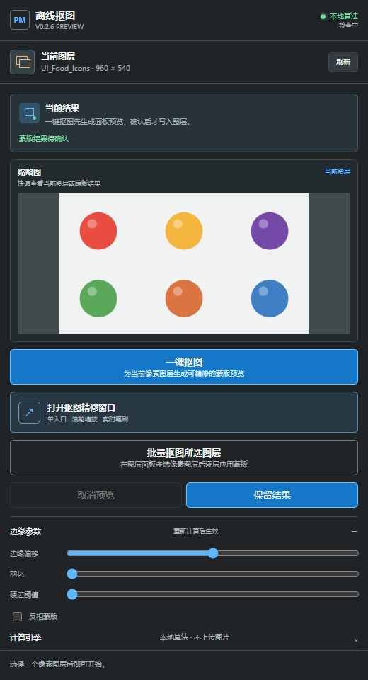
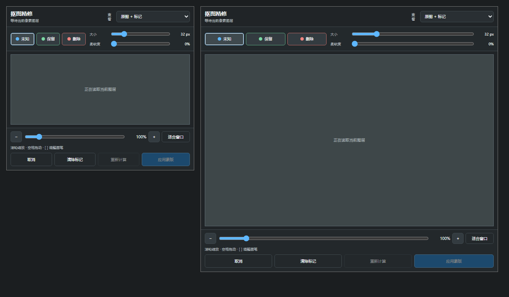

# PS Offline Mask Releases

Photoshop 抠图插件的公开下载仓库。

## 当前下载

请前往 [Releases](https://github.com/Homer79980/ps-offline-mask-releases/releases) 下载最新版本：

- `ps-offline-mask-*-uxp-preview.zip`：UXP Developer Tool 开发预览包
- `v0.3.5-preview`：Photoshop 25.0+ 的 UXP Developer Tool 预览包
- 生产 `.ccx`：待三平台原生运行时、Windows/macOS 签名、公证和真实 Photoshop 回归完成后发布

`v0.3.5-preview` 保留逐图残留质量门，并修复精修输入与边缘参数预览。精修窗口改由实际可见的预览区域接收鼠标/Pointer 事件，画笔覆盖层不再抢事件，`[`/`]` 也会直接绑定到获得焦点的画布框。主面板中的边缘收缩、抗锯齿柔化、硬边阈值和反相会从不可变基础 Alpha 在本机实时更新缩略图，不会重新调用完整抠图引擎或视觉模型 API。连续拖动采用防抖和最新结果优先；API 返回的前景 RGB 在 Alpha 改变后不会被错误复用。

精修窗口的画笔、滚轮缩放、空格平移和 `[`/`]` 会直接响应，不再等待一组输入事件全部通过。底部输入诊断只记录 Photoshop 实际转发了哪些事件，不会吞掉首次绘制；252 项自动化测试已通过，但真实 Photoshop 25+ 仍需用户按清单验收。

纯色/近纯色本地算法会处理与外边缘不连通的内部背景孔洞，并保留软 Alpha。`v0.3.5-preview` 的本地一键默认收缩 `1 px`，抗锯齿柔化提供关闭、1–4 px 五档且默认关闭；生成结果后调整这些参数会实时刷新缩略图。处于测得背景色容差带内、且达到面积门槛的封闭区按孔洞删除；若主体确有同容差色装饰，需在精修窗口用“保留”恢复。高饱和背景上的深色同色投影和 JPEG 偏色边缘不再直接升级为不透明前景；超出背景容差的显著近色歧义会失败关闭并要求精修或可选 Vision API，不承诺“任何图片都能抠净”。

“背景”图层和完全锁定的图层不会直接进入蒙版写入。请先双击“背景”转换为普通像素图层，或先解除图层锁定；批量模式会跳过这些图层并显示具体原因，避免对不支持写入的图层执行破坏性操作。

插件打开、切换文档或切换单个像素图层时会自动读取。即使切换发生在重算、应用或批处理期间，也会在当前操作安全结束后重查新图层；旧图层缩略图、Trimap、结果和精修会话不会残留。“刷新”保留为同一图层像素变化时的手动兜底。

批量处理仍固定使用本地算法并严格串行。非像素、背景和完全锁定图层会跳过；单层失败会恢复该层原蒙版后继续，如果连恢复也失败则立即停止，避免继续修改后续图层。文档、图层选择或边界变化也会停止后续写入。

从旧版本升级时，请在 UXP Developer Tool 中 Stop 并移除旧实例，重新解压当前 Release 包，然后 Add/Load 新目录中的 `manifest.json`。不要覆盖正在加载的旧目录；否则 Photoshop 可能继续运行旧 JavaScript 和旧窗口定义。自动化测试、语法检查、质量基准和预览包审计均会随 Release 记录；按用户要求，开发过程不自动操作 Photoshop，画笔、单层应用和批量写回仍由用户真机复测。

源码、测试和 PRD 位于私有源码仓库，不在本仓库维护。

## 安装与使用

- [安装说明](docs/INSTALL.md)
- [使用说明](docs/USAGE.md)

## 兼容性

- Photoshop 25.0+
- Windows x64、macOS Intel x64、macOS Apple Silicon arm64（开发预览阶段以 UXP 宿主实测为准）
- 默认纯本地算法；AI Vision API v1/v2 为可选运行时接口，但预览包不含端点、凭据或模型

## 校验

每个 Release 会附带 `SHA256SUMS.txt`。下载后建议先校验 SHA-256，再解压安装。

## 许可与反馈

当前项目尚未发布正式开源许可证。使用、再分发或集成到商业产品前，请先联系仓库维护者。问题反馈请使用本仓库的 Issues，不要提交任何 PSD、API Key、Cookie 或客户素材。
