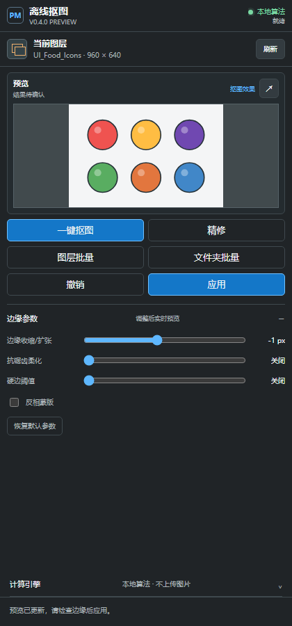
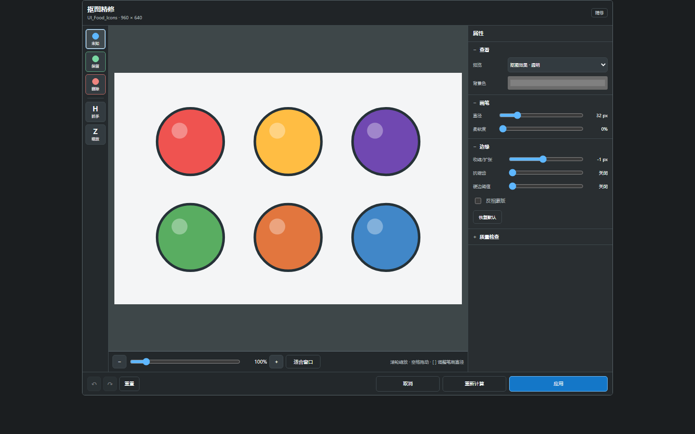

# PS Offline Mask Releases

Photoshop 抠图插件的公开下载仓库。

## 当前下载

请前往 [Releases](https://github.com/Homer79980/ps-offline-mask-releases/releases) 下载最新版本：

- `ps-offline-mask-*-uxp-preview.zip`：UXP Developer Tool 开发预览包
- `v0.4.1-preview`：Photoshop 25.0+ 的 UXP Developer Tool 预览包
- 生产 `.ccx`：待三平台原生运行时、Windows/macOS 签名、公证和真实 Photoshop 回归完成后发布

`v0.4.1-preview` 修复 UXP 精修输入：预览改用宿主支持的 DOM/PNG 图层，未知、保留、删除画笔与滚轮缩放直接绑定可见输入平面；支持空格平移、`H`/`Z`、`[`/`]`、Esc，以及按操作顺序撤销/重做整笔和边缘参数。

边缘参数已全部集中到工作区，柔边与硬边是互斥模式。透明、白、黑、灰和自定义背景都显示彩色抠图效果；连续拖动会中止旧计算，原始分辨率仍用于最终计算和写回。327 项自动化测试已通过，但真实 Photoshop 25+ 输入与写回仍需用户按清单验收。

纯色/近纯色本地算法会处理与外边缘不连通的内部背景孔洞，并保留软 Alpha。处于测得背景色容差带内、且达到面积门槛的封闭区按孔洞删除；高饱和背景上的深色同色投影和 JPEG 偏色边缘不会直接升级为不透明前景。超出容差的显著近色歧义会失败关闭并要求精修或可选 Vision API，不承诺“任何图片都能抠净”。

“背景”图层和完全锁定的图层不会直接进入蒙版写入。请先双击“背景”转换为普通像素图层，或先解除图层锁定；批量模式会跳过这些图层并显示具体原因，避免对不支持写入的图层执行破坏性操作。

插件打开、切换文档或切换单个像素图层时会自动读取。即使切换发生在重算、应用或批处理期间，也会在当前操作安全结束后重查新图层；旧图层缩略图、Trimap、结果和精修会话不会残留。“刷新”保留为同一图层像素变化时的手动兜底。

图层批量固定使用本地算法并严格串行。文件夹批量可选择源目录和输出目录，支持 PNG/JPG/JPEG/WebP、递归扫描、相对目录保留、透明 PNG 自动编号和安全停止；输出目录不创建 JSON 或其它旁车文件。非像素、背景和完全锁定图层会跳过；低置信度结果失败关闭，单项失败不会覆盖已有输出。

从旧版本升级时，请在 UXP Developer Tool 中 Stop 并移除旧实例，重新解压当前 Release 包，然后 Add/Load 新目录中的 `plugin/manifest.json`。不要覆盖正在加载的旧目录；否则 Photoshop 可能继续运行旧 JavaScript 和旧窗口定义。自动化测试、语法检查、质量基准和预览包审计均会随 Release 记录；按用户要求，开发过程不自动操作 Photoshop，画笔、单层应用和批量写回仍由用户真机复测。

源码、测试和 PRD 位于私有源码仓库，不在本仓库维护。

## 安装与使用

- [安装说明](docs/INSTALL.md)
- [使用说明](docs/USAGE.md)

## 兼容性

- Photoshop 25.0+
- Windows x64、macOS Intel x64、macOS Apple Silicon arm64（开发预览阶段以 UXP 宿主实测为准）
- 默认纯本地算法；AI Vision API v1/v2 为可选运行时接口，但预览包不含端点、凭据或模型

## 校验

每个 Release 会附带 `SHA256SUMS.txt`。下载后建议先校验 SHA-256，再解压安装。

## 许可与反馈

当前项目尚未发布正式开源许可证。使用、再分发或集成到商业产品前，请先联系仓库维护者。问题反馈请使用本仓库的 Issues，不要提交任何 PSD、API Key、Cookie 或客户素材。
