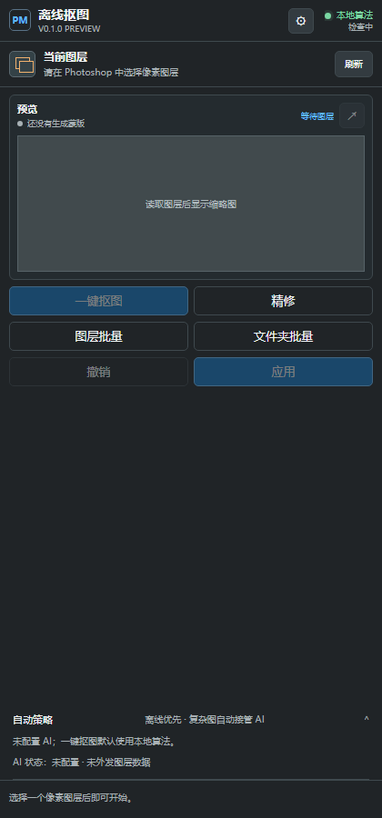

# PS Offline Mask Releases

Photoshop 离线抠图插件的公开下载与使用文档。源码在私有仓库维护，本仓库只发布安装包、校验值和面向用户的说明。

## 当前版本

[`v0.1.0`](https://github.com/Homer79980/ps-offline-mask-releases/releases/tag/v0.1.0) 面向 Photoshop 25.0+：

- 安装包：`ps-offline-mask-0.1.0.ccx`
- SHA-256：`0E38D53AE66DE0EE17A5D5FF50A67F3285AA050B8AA38FC850B57705C8D63498`
- [安装说明](docs/INSTALL.md)
- [错误代码 -1 排查](docs/CCX-INSTALL-FAQ.md)
- [操作说明](docs/USAGE.md)
- [本版变更](docs/RELEASE-v0.1.0.md)

## 安装

下载 CCX 后双击安装，在 Creative Cloud 中选择“本地安装”。当前包由 Adobe UXP Developer Tools 2.2.1 生成，并通过 Windows Unified Plugin Installer Agent 8.5.0.13 安装验证；尚未经过 Adobe Marketplace 审核和 macOS 安装回归。

如果曾在 2026-09-07 下载过旧的同名文件，请重新下载并核对以上新 SHA-256。旧包的 Windows 反斜杠 ZIP 路径可能触发 Creative Cloud 错误代码 `-1`。

升级时先在 Creative Cloud 的“插件 > 管理插件”中卸载旧版本；如果曾通过 UXP Developer Tool 加载开发版，也要先 Stop 并移除旧实例。重启 Photoshop 后，从“增效工具/插件”菜单打开“离线抠图”。

## 使用

1. 在 Photoshop 中选择普通、未完全锁定的像素图层。
2. 点击“一键抠图”，先在插件预览中检查透明结果。
3. 需要时进入“精修”，切换白、黑或自定义背景检查边缘，并调整收缩、柔边、硬边或去色边。
4. 重新计算后点击“应用”。插件保留源图，并以新图层或可撤销蒙版写入结果。

图层批量和文件夹批量固定使用本地算法。AI 视觉服务为可选功能；只有主动配置服务、授权外发且单图本地结果需要辅助时才会调用。

## 兼容性与边界

- Photoshop 25.0+
- Windows x64、macOS Intel x64、macOS Apple Silicon arm64，以实际 UXP 宿主为准
- 最适合透明图、棋盘格、纯色/近纯色背景、游戏和 UI 素材
- 发丝、玻璃、烟雾、复杂场景背景及主体与背景高度同色时，可能需要精修或专业 Alpha 模型

## 反馈

请使用本仓库 Issues。不要提交 PSD、API Key、Cookie、Authorization 头或客户素材。
