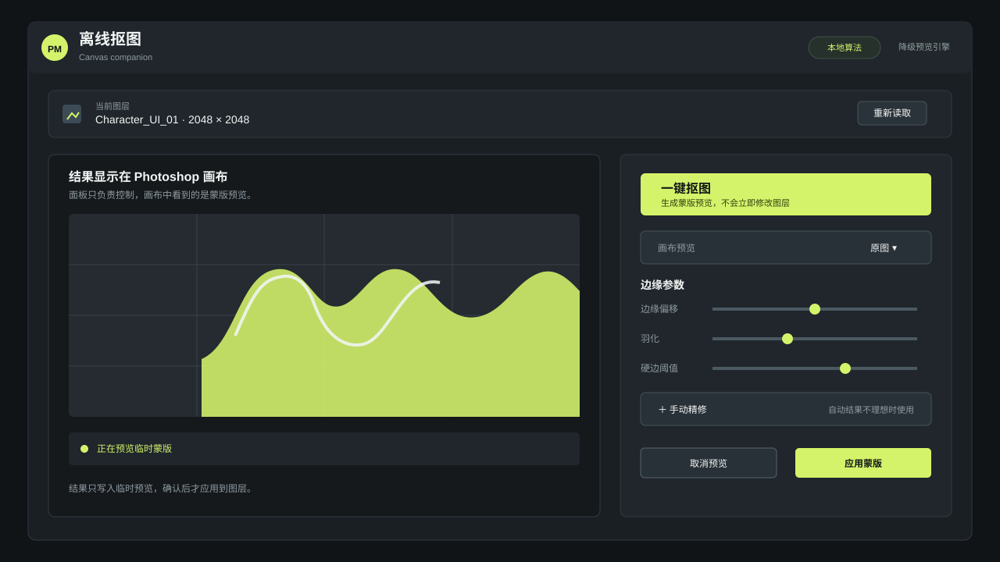

# 使用说明

## 快速开始

1. 在 Photoshop 中选择像素图层并点击“读取”。
2. 点击“一键抠图”。
3. 在 Photoshop 画布中检查临时蒙版结果。
4. 必要时展开“手动精修”，使用保留、删除和未知区域笔刷。
5. 调整边缘偏移、羽化和硬边阈值，点击“根据标记重新计算”。
6. 确认结果后点击“应用蒙版”。

默认流程完全离线。临时预览不会直接覆盖原始像素；预览失败时不能应用正式蒙版。

## AI 视觉模型

AI 模式不会默认启用。只有宿主注入完整的运行时 API 配置后，面板才会显示 AI 选项。启用前会显示目标主机和数据外发提示，用户必须确认后才发送图层像素、Trimap 和参数。远程端点必须使用 HTTPS。

## 已知限制

当前开发预览使用 fallback 算法验证工作流，不是生产级 matting 模型。复杂发丝、低对比度背景和半透明特效可能需要较多手动标记。原生 C++ 引擎和签名 `.ccx` 将在后续 Release 提供。
